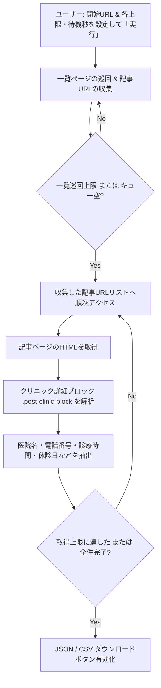

# Mynavi Clinic Scraper

マイナビクリニック (`https://clinic.mynavi.jp/*`) の一覧ページから各クリニック紹介記事を巡回（クローリング）し、詳細なクリニック情報を自動抽出して JSON または CSV 形式でエクスポートできる Chrome 拡張機能です。

---

## 🚀 主な機能

- **自動クローリング**: 指定した一覧ページ（`article_list`）から次のページリンクを自動巡回し、紹介記事（`article`）のURLをまとめて収集します。
- **詳細情報の抽出**: 各記事ページに記載されているクリニックの詳細ブロック（医院名、電話番号、診療時間、休診日など）を自動でパースして抽出します。
- **データエクスポート**: 抽出したクリニック情報を、JSON または CSV（Excelで文字化けしないBOM付きUTF-8）形式でワンクリックでダウンロード可能です。
- **高度なスクレイピング制御**: 巡回する一覧ページの上限、取得クリニック件数の上限、サーバー負荷軽減のためのリクエスト間ウェイト（待機秒）を画面上で細かく設定できます。

---

## 📊 取得情報（出力項目）

抽出されるデータは、以下の項目で構成されています。

| 項目名 (CSVヘッダー) | 説明 | 抽出元のロジック |
| :--- | :--- | :--- |
| **記事タイトル** | クリニックが紹介されている記事のタイトル | 記事の `h1.heading__title` などのヘッダーから抽出 |
| **診療科目** | 対象の市区町村・エリア名 | 記事タイトル内の都道府県名を検知し、該当する市区町村（例: 新宿区、川口市など）を自動抽出 |
| **電話番号** | クリニックの電話番号 | テーブル内の「電話番号」ラベル、またはテキスト内の電話番号パターン (`0xx-xxxx-xxxx`) から自動抽出 |
| **医院名** | クリニックの名称 | ブロック内の `.post-clinic-block_title` や見出し要素（`h2`, `h3`, `h4`, `strong` など）から抽出 |
| **午前始** | 午前の診療開始時間 | 診療時間テーブルから午前枠の開始時刻（例: `09:00`）をパース |
| **午前終** | 午前の診療終了時間 | 診療時間テーブルから午前枠の終了時刻（例: `12:30`）をパース |
| **午後始** | 午後の診療開始時間 | 診療時間テーブルから午後枠の開始時刻（例: `15:00`）をパース |
| **午後終** | 午後の診療終了時間 | 診療時間テーブルから午後枠の終了時刻（例: `18:30`）をパース |
| **休診日** | 休診日・休診曜日 | テーブル内の「休」マークや、「休診日：〇曜日」などのテキストから抽出 |

---

## 🛠 クローリングの仕組み

1. **一覧ページ（`article_list`）の巡回**:
   指定された「開始URL」からクロールを開始し、一覧ページ上のクリニック紹介記事へのリンク（`/article/...`）を収集します。同時に、「次のページ」等のリンクを辿り、指定された「一覧ページ上限」に達するまで一覧ページを再帰的に巡回します。
2. **記事ページ（`article`）の解析**:
   収集した各記事ページに対して非同期で `fetch` リクエストを送り、HTMLを取得します。
3. **ブロックごとのパース**:
   各記事に含まれるクリニック情報ブロック（`.post-clinic-block`）を特定し、その中から医院名、電話番号、診療時間テーブル、休診日などのテキストをパースして構造化データに変換します。
4. **ウェイトと制御**:
   マイナビクリニックのサーバーに過度な負荷をかけないよう、リクエスト間に「待機秒」で設定したインターバル（ウェイト）を挟んで動作します。

---

## 💻 使い方

### 1. インストール手順
1. 本ツールのリポジトリ（ソースコード一式）を任意のフォルダにダウンロードします。
2. Google Chrome を起動し、アドレスバーに `chrome://extensions/` と入力して拡張機能管理画面を開きます。
3. 画面右上の **「デベロッパー モード」** をオンにします。
4. 画面左上の **「パッケージ化されていない拡張機能を読み込む」** ボタンをクリックし、本ツールのフォルダ（`mynabi-clinic-scrape`）を選択します。

### 2. スクレイピングの実行手順
1. Chromeのツールバー（画面右上）の拡張機能アイコン（パズルのマーク）から **Mynavi Clinic Scraper** をクリックします。
2. ポップアップ内の **「スクレイパーを開く」** ボタンをクリックすると、専用のコントロールパネル（ダッシュボード）が別タブで開きます。
3. コントロールパネルで以下の設定を行います：
   - **開始URL**: マイナビクリニックの収集を開始したい一覧ページのURL（初期設定されているデフォルトURLでも実行可能です）
   - **一覧ページ上限**: 最大で何ページ分の一覧を巡回するか（デフォルト: 80）
   - **取得件数上限(0=全件)**: 取得するクリニック数の上限（0を指定すると制限なしで全件取得）
   - **待機秒**: サーバー負荷軽減のため、1リクエストごとに待機する時間（推奨: 0.4秒以上）
4. **「実行」** ボタンをクリックすると、スクレイピングが開始されます。
5. 実行中は「ログ」パネルに進行状況がリアルタイムで出力されます。
6. 処理が完了すると、ステータスが「完了: 〇件」になり、**「JSON保存」** および **「CSV保存」** ボタンが有効化されます。ボタンをクリックしてデータをダウンロードしてください。

---

## 📂 ファイル構成

- `manifest.json`: 拡張機能の設定ファイル (Manifest V3)
- `popup.html` / `popup.js`: 拡張機能アイコンをクリックした際のポップアップUIと制御
- `scraper.html` / `scraper.css` / `scraper.js`: メインのスクレイピング・コントロールパネルUIとクローラーロジック
- `README.md`: 本説明書
